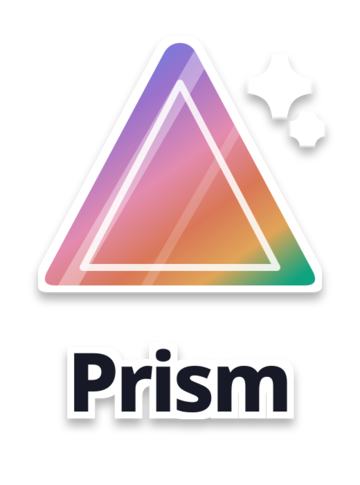
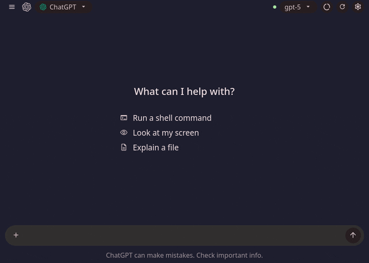
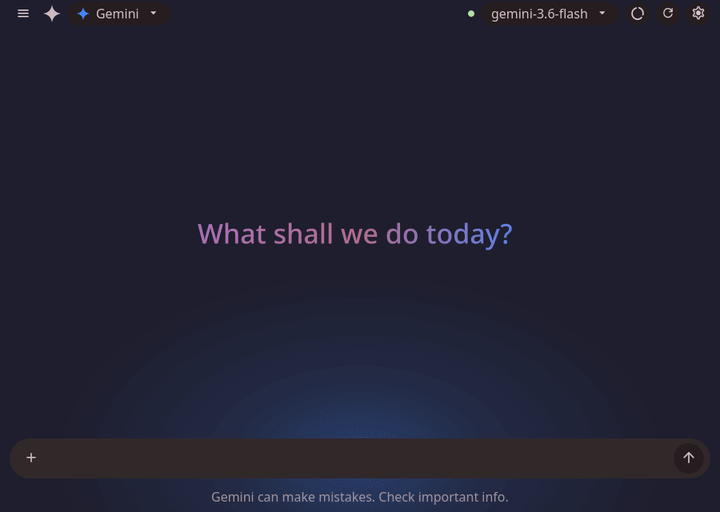
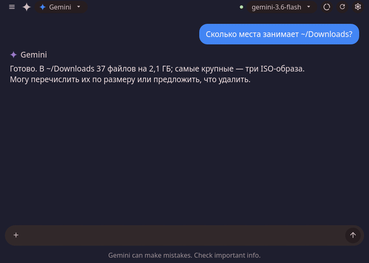
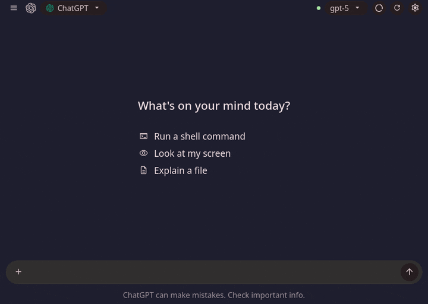

<p align="center">
  
</p>

<h3 align="center">Gemini, Claude, ChatGPT and Ollama as a tab in your desktop shell</h3>

<p align="center">
  A chat tab for the <a href="https://github.com/caelestia-dots/shell">Caelestia</a> shell (Hyprland · quickshell), backed by a small local daemon.<br>
  Pick a provider — the tab, its composer and the glow around your screen take that provider's colours.
</p>

<p align="center">
  <a href="LICENSE"></a>
  
  
  
</p>

<p align="center">
  
</p>

<br>

## Four providers, four looks

The tab does not just swap a logo. Greeting, typography, composer, accent colours and the glow that
frames the screen all follow the active provider, so each one feels like its own web app.

<table>
  <tr>
    <td align="center" width="50%"><br><sub><b>Gemini</b> · gradient greeting, blue glow, pill composer</sub></td>
    <td align="center" width="50%"><br><sub><b>Claude</b> · serif greeting, chips, boxed composer</sub></td>
  </tr>
  <tr>
    <td align="center" width="50%"><br><sub><b>ChatGPT</b> · plain greeting, starter list, neutral pill</sub></td>
    <td align="center" width="50%"><br><sub><b>Ollama</b> · llama avatar, steel palette, boxed composer, runs locally</sub></td>
  </tr>
</table>

## Features

<table>
  <tr>
    <td width="50%" valign="top">
      <br>
      <b>Shell commands, with your permission</b><br>
      <sub>The model can run read-only commands through <code>run_bash</code>. Every call is evaluated first — commands that could never run are refused without asking; the rest show an opencode-style prompt docked to the composer. Pick <code>ls *</code> or the exact command and “Allow always” remembers it. Keyboard driven.</sub>
    </td>
    <td width="50%" valign="top">
      <br>
      <b>Settings that look like the web apps’ dialogs</b><br>
      <sub>Connection (key in the OS keyring, test / remove, endpoint), Behaviour (system instruction), Appearance (screen glow), Permissions (allow / deny rules). The save bar lights up only when something changed.</sub>
    </td>
  </tr>
  <tr>
    <td width="50%" valign="top">
      <br>
      <b>Chats you can come back to</b><br>
      <sub>A history drawer with auto-titled sessions, rename and delete. Sessions persist across shell restarts.</sub>
    </td>
    <td width="50%" valign="top">
      <br>
      <b>Models and quota at a glance</b><br>
      <sub>Model list fetched from the provider, per-model request and token counters against the daily limit — in a dropdown, not a config file.</sub>
    </td>
  </tr>
</table>

Also: **screen watching** (“look at my screen” records the desktop and lets the model describe it),
**clipboard images** and **file attachments**, **Cloudflare worker routing** for regions where Gemini is
blocked, and **usage tracking** per model with the provider's daily limits surfaced in the quota panel.

## Install

```bash
curl -fsSL https://raw.githubusercontent.com/skiffuff/prism-chat-tab/main/install.sh | bash
```

The installer copies the tab into your Caelestia shell tree and wires it into the dashboard with four
small, marked edits (`Content.qml`, `shell.qml`, `ContentWindow.qml`, `ServiceLoader.qml`; originals kept
as `*.prism-orig`), puts the daemon into `~/.local/share/prism` with its own virtualenv, and writes a user
unit. It knows Caelestia **2.4.x**; on any other version it stops before changing anything. A packaged
shell (`/etc/xdg/quickshell/caelestia`) is first copied to `~/.config/quickshell/caelestia`, which
quickshell prefers. Then give the daemon a key and start it:

```bash
export GEMINI_API_KEY=...            # or ANTHROPIC_API_KEY / OPENAI_API_KEY; Ollama needs none
systemctl --user enable --now prism-daemon
```

Restart the shell (`caelestia shell -k; caelestia shell -d`) and open the dashboard — Prism is the last
tab. Keys can also be pasted into **Settings → Connection**; they go to the OS keyring, never to a file.
`~/.local/share/prism/uninstall.sh` puts the shell files back and removes the daemon (`--purge` also
drops config, sessions and keys).

**Beta — testers wanted.** If you run Caelestia, [TESTING.md](TESTING.md) has a 20-minute checklist and
the bug template asks for exactly the logs that help.

<details>
<summary><b>Requirements and optional tools</b></summary>

| Need | Package |
|---|---|
| Required | Hyprland + Caelestia shell 2.4.x (quickshell), `python3`, `curl` |
| NixOS | the store tree is read-only: mirror it somewhere writable, launch the shell from the mirror and set `PRISM_SHELL_DIR` to it |
| Keys in the keyring | a Secret Service provider (GNOME Keyring, KWallet, KeePassXC) |
| Screen watching | `wf-recorder` (or `ffmpeg` with PipeWire) |
| Clipboard images | `wl-clipboard` |
| File picker | `zenity` |

</details>

<details>
<summary><b>Keybind</b></summary>

The tab exposes an IPC target, so a Hyprland bind can open the chat directly:

```
bind = SUPER, A, exec, caelestia shell prism toggle
```

`prism open` · `prism close` · `prism toggle` · `prism reload`

</details>

## Configuration

`~/.config/prism/config.json` — everything here is also editable from the Settings pane.

```jsonc
{
  "provider": "gemini",                  // gemini | anthropic | openai | ollama
  "model": "gemini-3.6-flash",
  "system_instruction": "You are a helpful assistant…",
  "worker_url": "",                      // optional Cloudflare worker proxy for Gemini
  "anthropic_url": "",                   // optional proxies; empty = vendor API
  "openai_url": "",
  "ollama_url": "http://127.0.0.1:11434", // local Ollama server
  "glow": { "enabled": true, "sigma": 64, "alpha": 0.8 }   // sigma = how far the glow spreads (px)
}
```

| Environment | Purpose |
|---|---|
| `GEMINI_API_KEY` `ANTHROPIC_API_KEY` `OPENAI_API_KEY` | fallback when no key is in the keyring |
| `PRISM_USER_NAME` | the name Claude greets you with (defaults to your login) |
| `PRISM_PORT` / `PRISM_DAEMON_URL` | run the daemon on another port / point the tab at it |

## Security model

The daemon listens on `127.0.0.1` only and every request carries a per-install token.
The interesting part is the shell tool:

- **Allowlist, not blocklist.** `run_bash` executes with `shell=False` from a fixed list of read-only
  commands (`ls`, `stat`, `du`, `wc`, `ps`, `date`, `dig`, …). No interpreters, no writers, no pipes.
- **Evaluate before asking.** Each call resolves to *deny* (outside the allowlist, protected path,
  a deny rule), *allow* (a stored allow rule) or *ask*. Only *ask* interrupts you.
- **Rules you can read.** `~/.config/prism/permissions.json` holds `{pattern, action}` entries,
  matched deny-first. “Allow always” stores exactly the pattern you picked in the prompt.
- **Some things never persist.** Anything on the dangerous list, and anything that reaches the network
  (`ping`, `dig`, …), can run once but can never become a rule.
- **Credentials stay out of reach.** Paths under `~/.ssh`, `~/.gnupg`, browser profiles, token files,
  `.env`, `*.pem` and the daemon's own state are refused as arguments and in `/read_file`.
- **Output is bounded and scrubbed.** 64 KB cap per command, API keys and tokens redacted from
  anything that goes back to the model, prompts that nobody answers time out into a recorded denial.
- Rate limit on `/chat`, no CORS, keys only in the keyring, state files `0600`.

## How it fits together

```
frontend/                      QML overlay onto the Caelestia shell root
  modules/dashboard/PrismTab.qml    state + layout
  modules/dashboard/prism/*.qml     TopBar, EmptyState, composers, PermissionDialog, SettingsPane, …
  services/GeminiChat.qml           daemon client singleton, "prism" IPC target
scripts/shell-patch.py         wires the tab into a stock shell tree (apply / revert / check)

backend/                       FastAPI daemon, 127.0.0.1:5000
  prism/config.py                   paths, provider registry, config.json
  prism/security.py                 token, rate limit, file policy, run_bash sandbox, rules
  prism/providers/                  gemini · anthropic · openai · ollama behind one canonical message format
  prism/api/                        chat, providers, sessions, files, settings, watch
```

A message goes tab → `/chat` → provider → either an answer or a `run_bash` request → `evaluate()` →
(prompt →) `/tool/confirm` → result back to the model → answer. Sessions, usage and rules are plain JSON
under `~/.local/share/prism` and `~/.config/prism`.

<details>
<summary><b>API</b></summary>

| Endpoint | Method | Purpose |
|---|---|---|
| `/chat` | POST | send a message; may return `{"pending": …}` for a tool call |
| `/tool/confirm` | POST | `allow` · `never` (+ `pattern`) · `deny` |
| `/providers` `/provider` | GET · POST | list / switch provider |
| `/models` `/model` | GET · POST | list / switch model |
| `/sessions` `/session/{new,select,rename,delete}` | GET · POST | chat sessions |
| `/history` `/clear` | GET · POST | active session |
| `/settings` `/settings/validate` | GET · PUT · POST | settings, key check |
| `/permissions` | GET · POST · DELETE | allow / deny rules |
| `/read_file` `/pick_file` `/clipboard_image` | POST | attachments |
| `/watch/{start,stop,status}` | POST · GET | screen watching |
| `/quota` `/health` | GET | usage, liveness |

</details>

## Developing

```bash
scripts/deploy-local.sh        # backend → ~/.local/share/prism, frontend → shell tree, restart daemon
```

quickshell hot-reloads QML it has already loaded; new files load when the dashboard opens next.
The tab can be rendered offscreen (`QT_QPA_PLATFORM=offscreen`) against a daemon started with
`PRISM_PORT` — that is how the previews above were made.

## Troubleshooting

| Symptom | Fix |
|---|---|
| Installer says the shell version is unsupported | it only patches trees it recognises (2.4.x) and changed nothing — open an issue with your version |
| Tab missing after install | the shell must be restarted; check `caelestia shell -l` for `PrismTab` errors |
| Daemon won't start | `~/.local/share/prism/venv/bin/pip install -r ~/.local/share/prism/requirements.txt` |
| Provider says *no key* | export the env var or paste the key in Settings → Connection |
| Gemini blocked in your region | set `worker_url` to a Cloudflare worker that proxies `generativelanguage.googleapis.com` |
| Claude greets you by your login | `PRISM_USER_NAME="…"` in the shell's environment |
| Screen watching does nothing | install `wf-recorder`; the trigger phrases are “look at my screen” / “посмотри на экран” |

---

<p align="center">
  <sub>This project was written, debugged and iterated entirely with an LLM. MIT licensed.</sub>
</p>
